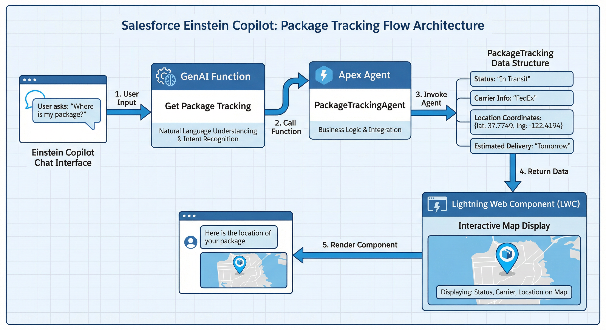
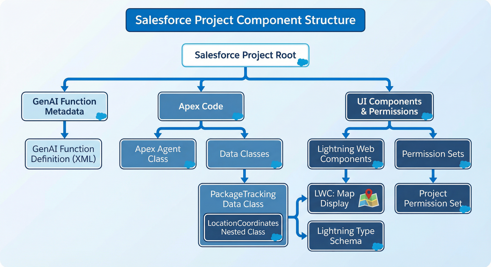
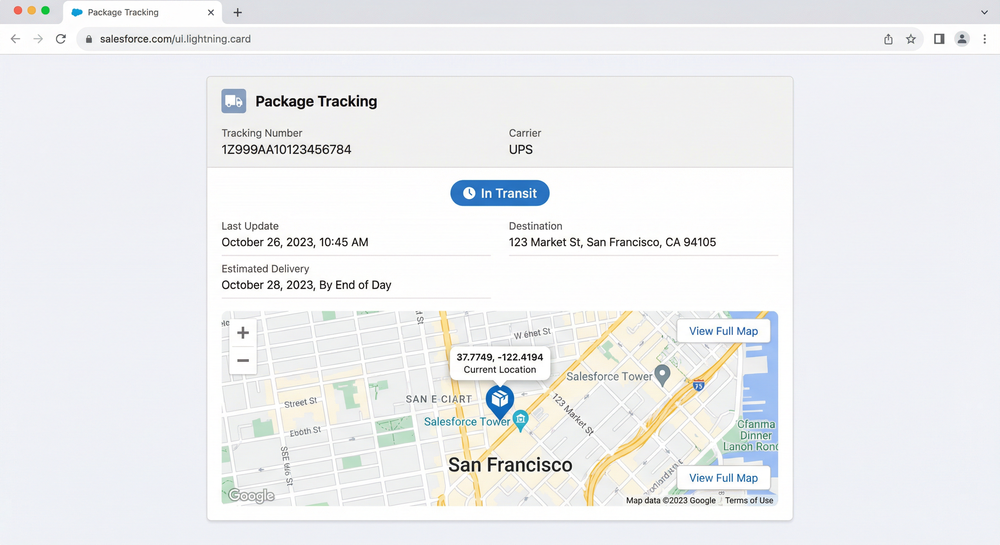

# Package Tracking with Agentforce

A Salesforce solution that enables users to track packages using natural language queries through Agentforce. The solution retrieves comprehensive package tracking information including real-time location coordinates, delivery status, carrier details, and estimated delivery dates, then displays the package location on an interactive map.



## Overview

This project demonstrates how to integrate Agentforce with custom Apex agents and Lightning Web Components to create an intelligent package tracking experience. Users can simply ask "Where is my package?" or "Track package 1Z999AA10123456784" in Agentforce, and the system will retrieve and display tracking information with an interactive map visualization.

## How It Works

### Architecture Flow

1. **User Query**: User asks about package tracking in Agentforce chat interface
2. **GenAI Function**: Agentforce recognizes the intent and invokes the "Get Package Tracking" GenAI Function
3. **Apex Agent**: The GenAI Function calls the `PackageTrackingAgent` Apex class
4. **Data Retrieval**: The Apex agent retrieves package tracking data (currently using sample data, but can be extended to call external APIs)
5. **Response**: Package tracking information is returned including:
   - Tracking number
   - Carrier information
   - Current status
   - Current location coordinates (latitude/longitude)
   - Estimated delivery date
   - Destination address
6. **Visualization**: The Lightning Web Component displays the data in a card with an interactive map showing the package's current location



## Components

### 1. GenAI Function (`Get_Package_Tracking`)
- **Location**: `force-app/main/default/genAiFunctions/Get_Package_Tracking/`
- **Purpose**: Exposes the package tracking capability to Agentforce
- **Configuration**:
  - Invokes `PackageTrackingAgent` Apex class
  - Shows progress indicator: "Retrieving your package data."
  - No confirmation required for invocation

### 2. Apex Agent (`PackageTrackingAgent`)
- **Location**: `force-app/main/default/classes/PackageTrackingAgent.cls`
- **Purpose**: Processes package tracking requests and returns structured data
- **Features**:
  - `@InvocableMethod` that accepts a tracking number
  - Returns comprehensive package tracking information
  - Currently uses sample data (can be extended to integrate with external APIs like UPS, FedEx, DHL, etc.)

### 3. Data Model (`PackageTracking`)
- **Location**: `force-app/main/default/classes/PackageTracking.cls`
- **Purpose**: Defines the data structure for package tracking information
- **Properties**:
  - `trackingNumber`: Unique package identifier
  - `carrier`: Shipping carrier name (UPS, FedEx, etc.)
  - `status`: Current delivery status
  - `currentLocation`: LocationCoordinates object with lat/long and address
  - `estimatedDeliveryDate`: Expected delivery date/time
  - `lastUpdate`: Last status update timestamp
  - `destinationAddress`: Final delivery address

### 4. Lightning Type (`PackageTracking`)
- **Location**: `force-app/main/default/lightningTypes/PackageTracking/`
- **Purpose**: Defines a custom Lightning type for structured data display in Agentforce
- **Schema**: Maps to the `PackageTracking` Apex class

### 5. Lightning Web Component (`packageTrackingMap`)
- **Location**: `force-app/main/default/lwc/packageTrackingMap/`
- **Purpose**: Displays package tracking information with an interactive map
- **Features**:
  - Shows tracking details in a Lightning card
  - Displays package location on an interactive map using `lightning-map`
  - Shows status badge, carrier, delivery estimates
  - Handles cases where location data is unavailable



### 6. Permission Set (`PackageTrackingAccess`)
- **Location**: `force-app/main/default/permissionsets/PackageTrackingAccess.permissionset-meta.xml`
- **Purpose**: Grants users access to the package tracking functionality

## Setup Instructions

### Prerequisites
- Salesforce org with Agentforce enabled
- Salesforce CLI (SFDX) installed
- VS Code with Salesforce Extensions (recommended)

### Deployment Steps

1. **Clone or download this repository**
   ```bash
   git clone <repository-url>
   cd agentforce-lwc-output
   ```

2. **Authorize your Salesforce org**
   ```bash
   sf org login web --alias myorg
   ```

3. **Deploy the metadata**
   ```bash
   sf project deploy start
   ```

4. **Assign the Permission Set**
   - Navigate to Setup → Permission Sets
   - Find "Package Tracking Access"
   - Assign it to users who need access

5. **Enable Agentforce** (if not already enabled)
   - Navigate to Setup → Agentforce
   - Follow the setup wizard

### Testing the Solution

1. **Open Agentforce** in your Salesforce org
2. **Ask a question** like:
   - "Where is my package?"
   - "Track package 1Z999AA10123456784"
   - "Get tracking information for 1Z999AA10123456784"
3. **View the results** - The component will display:
   - Package tracking details
   - Interactive map with package location marker

## Extending the Solution

### Integrating with Real APIs

The `PackageTrackingAgent` class currently uses sample data. To integrate with real carrier APIs:

1. **Add Named Credentials** for API authentication
2. **Update `PackageTrackingAgent.getPackageTracking()`** to:
   - Call external APIs (UPS, FedEx, DHL, etc.)
   - Parse API responses
   - Map to `PackageTracking` data structure
3. **Add error handling** for API failures
4. **Implement caching** for frequently queried packages

### Example API Integration Pattern

```apex
// In PackageTrackingAgent.cls
HttpRequest req = new HttpRequest();
req.setEndpoint('callout:UPS_API/track');
req.setMethod('POST');
req.setBody(JSON.serialize(requestBody));
HttpResponse res = new Http().send(req);
// Parse response and map to PackageTracking object
```

### Adding More Features

- **Multiple packages**: Extend to track multiple packages simultaneously
- **Delivery history**: Show package movement history on the map
- **Notifications**: Set up alerts for delivery status changes
- **Custom fields**: Add organization-specific tracking fields

## Project Structure

```
agentforce-lwc-output/
├── force-app/
│   └── main/
│       └── default/
│           ├── classes/
│           │   ├── PackageTracking.cls
│           │   ├── PackageTracking.cls-meta.xml
│           │   ├── PackageTrackingAgent.cls
│           │   └── PackageTrackingAgent.cls-meta.xml
│           ├── genAiFunctions/
│           │   └── Get_Package_Tracking/
│           │       ├── Get_Package_Tracking.genAiFunction-meta.xml
│           │       ├── input/
│           │       │   └── schema.json
│           │       └── output/
│           │           └── schema.json
│           ├── lightningTypes/
│           │   └── PackageTracking/
│           │       ├── schema.json
│           │       └── lightningDesktopGenAi/
│           │           └── renderer.json
│           ├── lwc/
│           │   └── packageTrackingMap/
│           │       ├── packageTrackingMap.html
│           │       ├── packageTrackingMap.js
│           │       ├── packageTrackingMap.js-meta.xml
│           │       └── packageTrackingMap.css
│           └── permissionsets/
│               └── PackageTrackingAccess.permissionset-meta.xml
├── manifest/
│   └── package.xml
├── config/
│   └── project-scratch-def.json
├── assets/
│   ├── architecture-diagram.png
│   ├── component-structure.png
│   └── ui-mockup.png
├── sfdx-project.json
└── README.md
```

## API Version

This project uses Salesforce API version **64.0**.

## Resources

- [Agentforce Documentation](https://help.salesforce.com/s/articleView?id=sf.einstein_copilot_overview.htm)
- [GenAI Functions Guide](https://developer.salesforce.com/docs/atlas.en-us.apexcode.meta/apexcode/apex_genai_functions.htm)
- [Lightning Web Components](https://developer.salesforce.com/docs/component-library/documentation/en/lwc)
- [Salesforce DX Developer Guide](https://developer.salesforce.com/docs/atlas.en-us.sfdx_dev.meta/sfdx_dev/sfdx_dev_intro.htm)

## License

This project is provided as-is for demonstration and educational purposes.

## Support

For issues or questions, please open an issue in the repository or contact your Salesforce administrator.
